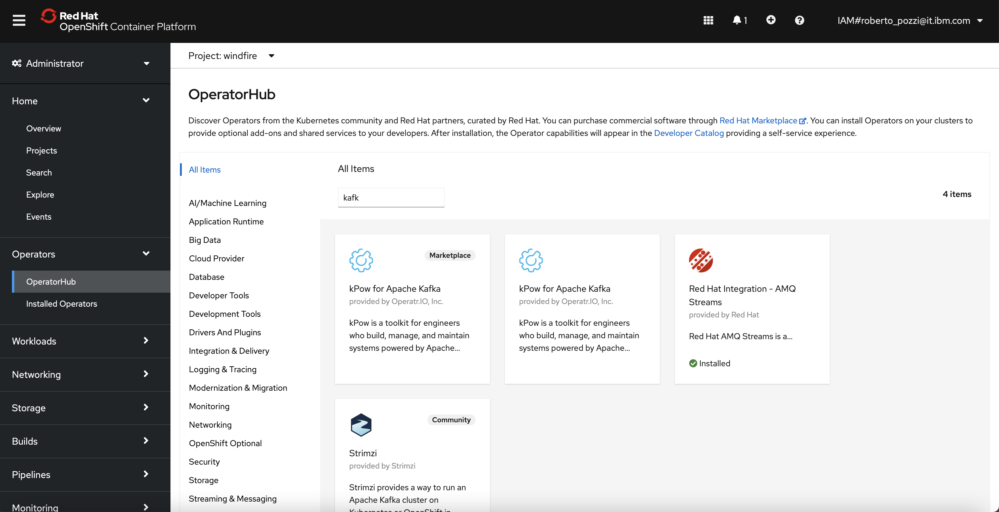
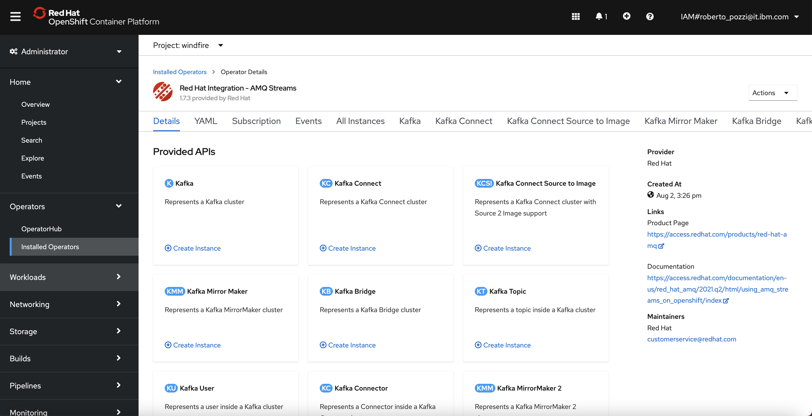
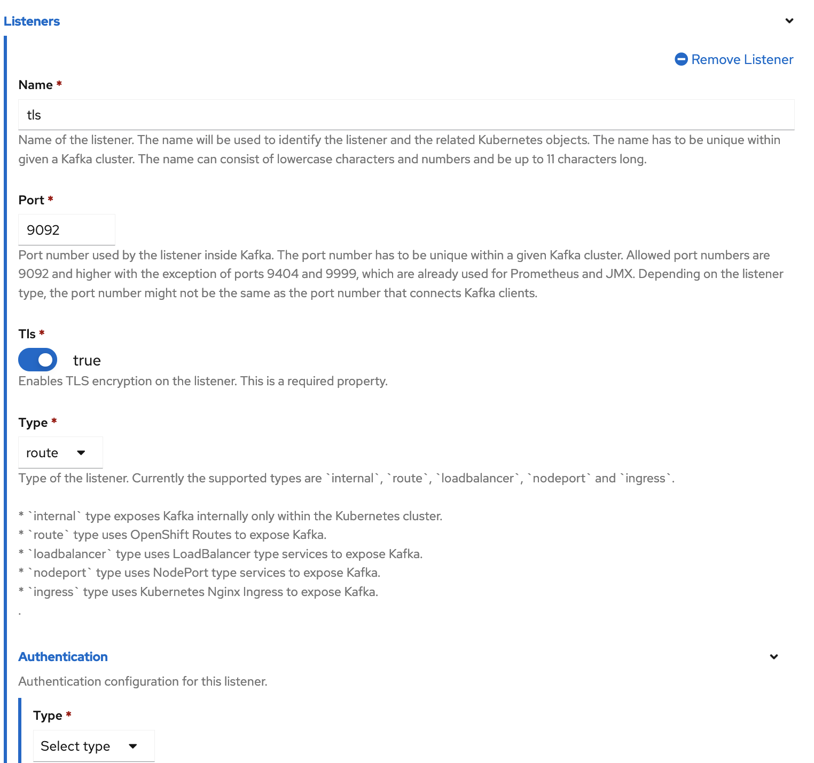

# Raspberry sensors project - PART 1
- [Introduction](#introduction)
- [Architecture](#architecture)
- [Kafka cluster setup](#kafka-cluster-setup)
- [Send simulated data to Kafka with Python](#send-simulated-data-to-kafka-with-python)

## Introduction
In this first part we will concentrate on Kafka setup and how to send data from Raspberry Pi to a Kafka cluster using a Python program; we will go through the following steps:
* Deploy a Kafka cluster, using Red Hat AMQ Streams Operator available on Red Hat Openshift;
* Get the TLS certificate from Kafka and generate PEM files to securely connect to Kafka;
* Deploy a Python program to Raspberry Pi to send data to Kafka (data will be simulated, then in a future article we will build on this and get real data from DHT11).

To access code and scripts for the project, start by cloning this repository 
```
mkdir $HOME/dev
cd $HOME/dev
git https://github.com/robipozzi/robipozzi-raspberry-sensors 
cd robipozzi-raspberry-sensors/Part1
```

## Architecture
The overall architecture design is very simple: a Python program runs on a Raspberry board, reads data from a sensor and continuously sends sensor data to a Kafka topic. A web server, implemented in Node.js, consumes data from the Kafka topic and continuously updates a UI via Web Socket.

The logical architecture is sketched below


## Kafka cluster setup
Kafka is a distributed system consisting of servers and clients that communicate via a high-performance TCP network protocol. It can be deployed on bare-metal hardware, virtual machines, and containers in on-premise as well as cloud environments, more info are available at https://kafka.apache.org/intro.

I find very convenient to instantiate it on Red Hat Openshift using Operator Hub, which provides Red Hat AMQ Streams, a massively scalable, distributed, and high performance data streaming platform based on the Apache Kafka® project; Red Hat AMQ Streams is built on the upstream open source project Strimzi.

In Red Hat Openshift console go to **OperatorHub**, search for Kafka and click on Red Hat AMQ Streams operator tile, as below



Once the operator has been installed, go to **Installed Operators** and select Red Hat AMQ Streams, you will land on the operator administration page where you can create, configure and delete Apache Kafka clusters, topics and many more.



From the Red Hat AMQ Streams operator administration page, do the following:

* Create a Kafka cluster, name it **robipozzi-kafka**, ensure there is at least 1 listener of type **route** named **tls**: since it is of type route, this listener requires to have **tls=true** meaning that connection to the listener will be required to be secured with a TLS certificate.



* Create a Kafka topic and name it **sensor**.

## Send simulated data to Kafka with Python
Before starting to send data to Kafka, we need to generate PEM files in order for Python to connect securely to the Kafka cluster deployed on OpenShift; do the following:
```
## Login to Openshift 

## Extract the certificate key from the Openshift Secret
oc extract secret/robipozzi-kafka-cluster-ca-cert --keys=ca.crt --to=certs --confirm -n openshift-operators

## Import extracted certificate to a Truststore
keytool -import -trustcacerts -alias root -file certs/ca.crt -keystore certs/truststore.jks -storepass password -noprompt
```

* The **[pem-converter.sh](security/pem-converter.sh)** script calls **[jkstopem.sh](security/jkstopem.sh)** which takes the keystore and generates the PEM file that can then be used by Python program to securely connect to Kafka.
```
cd $HOME/dev/windfire-home-automation/security
./pem-converter.sh
```

### Deployment to Raspberry
Python program needs to run on Raspberry, the Ansible playbook **[home-automation.yaml](deployment/raspberry/home-automation.yaml)** is provided to fully automate the deployment, run **[install.sh](deployment/raspberry/install.sh)** script to launch the deployment procedure.
```
cd $HOME/dev/windfire-home-automation/deployment/raspberry
./install.sh
```
Refer to https://github.com/robipozzi/windfire-raspberry for instructions on how to setup Ansible on Raspberry.

Python program **[sensor.py](kafka/sensor.py)** uses some Python modules that need to be imported and available in the environment: required modules are defined in **[requirements.txt](kafka/requirements.txt)** file.

Once you have deployed the program, **connect to Raspberry and launch the following**
```
cd /home/pi/home-automation/kafka
./pip-install.sh
```
The script will install all the required Python modules; after this you are finally ready to launch Python program with the following:
```
cd /home/pi/home-automation/kafka
./run-sensor.sh
```

All the magic happens in sensor.py Python program, which simulates data from DHT11 sensor and sends to a Kafka topic; Run the following:
```
## Set Bootstrap server for Kafka on Red Hat Openshift
BOOTSTRAP_SERVER=<SET THE RIGHT BOOTSTRAP SERVER FOR YOUR KAFKA CLUSTER>

## Run Python program
KAFKA_BROKER=$BOOTSTRAP_SERVER SSL=true TOPIC=sensor python sensor.py
```