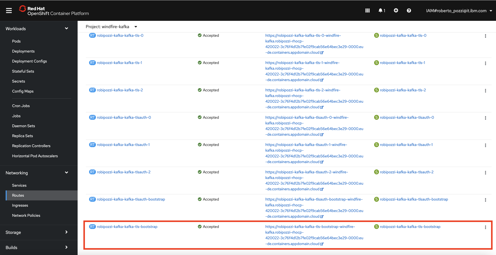

# Raspberry sensors project - PART 1
- [Introduction](#introduction)
- [Architecture](#architecture)
- [Kafka cluster setup](#kafka-cluster-setup)
- [Send simulated data to Kafka with Python](#send-simulated-data-to-kafka-with-python)

## Introduction
In this first part we will concentrate on Kafka setup and how to send data from Raspberry Pi to a Kafka cluster using a Python program; we will go through the following steps:
* Deploy a Kafka cluster, using Red Hat AMQ Streams Operator available on Red Hat Openshift;
* Get the TLS certificate from Kafka and generate PEM files to securely connect to Kafka;
* Deploy a Python program to Raspberry Pi to send data to Kafka (data will be simulated, then in a future article we will build on this and get real data from DHT11).

To access code and scripts for the project, start by cloning this repository 
```
mkdir $HOME/dev
cd $HOME/dev
git clone https://github.com/robipozzi/robipozzi-raspberry-sensors 
cd robipozzi-raspberry-sensors/Part1
```

## Architecture
The overall architecture design is very simple: a Python program runs on a Raspberry board, reads data from a sensor and continuously sends sensor data to a Kafka topic. A web server, implemented in Node.js, consumes data from the Kafka topic and continuously updates a UI via Web Socket.

The logical architecture is sketched below


## Kafka cluster setup
Kafka is a distributed system consisting of servers and clients that communicate via a high-performance TCP network protocol. It can be deployed on bare-metal hardware, virtual machines, and containers in on-premise as well as cloud environments, more info are available at https://kafka.apache.org/intro.

I find very convenient to instantiate it on Red Hat Openshift using Operator Hub, which provides Red Hat AMQ Streams, a massively scalable, distributed, and high performance data streaming platform based on the Apache Kafka® project; Red Hat AMQ Streams is built on the upstream open source project Strimzi.

In Red Hat Openshift console go to **OperatorHub**, search for Kafka and click on Red Hat AMQ Streams operator tile, as below


Once the operator has been installed, go to **Installed Operators** and select Red Hat AMQ Streams, you will land on the operator administration page where you can create, configure and delete Apache Kafka clusters, topics and many more.


From the Red Hat AMQ Streams operator administration page, do the following:

* Create a Kafka cluster, name it **robipozzi-kafka**, ensure there is at least 1 listener of type **route** named **tls**: since it is of type route, this listener requires to have **tls=true** meaning that connection to the listener will be required to be secured with a TLS certificate.


* Create a Kafka topic and name it **sensor**.

Once the previous steps have been completed, Kafka cluster with listeners and topic will run as pods within Red Hat Openshift and a Route will be configured to allow access from outside the cluster.

In the Openshift console go to Networking → Route and write down the Route for Kafka Bootstrap Server, as below.



## Send simulated data to Kafka with Python
The Kafka cluster running on Openshift is secured by default (Secrets are created within the cluster to hold TLS certificates) so, before starting to send data to Kafka, we need to extract the certificate from Kafka cluster:
* Login to Openshift cluster.
* Extract the certificate from Openshift Secret.
* Create a truststore to hold the certificate.
```
## Login to Openshift 

## Extract the certificate key from the Openshift Secret
oc extract secret/robipozzi-kafka-cluster-ca-cert --keys=ca.crt --to=certs --confirm -n openshift-operators

## Import extracted certificate to a Truststore
keytool -import -trustcacerts -alias root -file certs/ca.crt -keystore certs/truststore.jks -storepass password -noprompt
```
And then generate PEM files in order for a Python program to securely connect to Kafka.
The **[jkstopem.sh](jkstopem.sh)** script is provided to do the job, run the following
```
./jkstopem.sh certs truststore.jks password root kafka/certs
```

### Deploy and run Python program on Raspberry
Python program needs to run on Raspberry, an Ansible playbook **[home-automation.yaml](deployment/home-automation.yaml)** is provided to fully automate the deployment, run the following
```
cd deployment
ansible-playbook home-automation.yaml
```
Refer to https://github.com/robipozzi/windfire-raspberry for instructions on how to setup Ansible on Raspberry.

Connect to Raspberry and you should find something like this


All the magic actually happens in **[sensor.py](kafka/sensor.py)** Python program, which simulates data from DHT11 sensor and sends to a Kafka topic.

The **[sensor.py](kafka/sensor.py)** program uses some Python modules that need to be imported and available in the environment before you can run it: required modules are defined in **[requirements.txt](kafka/requirements.txt)** dependency file.

When still connected to Raspberry Pi box run the following
```
cd /home/pi/home-automation/kafka
sudo pip install -r requirements.txt
```
With this we are all set and ready to run Python program with the following commands

**Pay attention to this**
Get Route URL for Bootstrap Server (as seen in Figure 5) and remember to:
- strip **https://** away from the Route URL
- always add port **443** to the URL

```
## Set Bootstrap server for Kafka on Red Hat Openshift
BOOTSTRAP_SERVER=robipozzi-kafka-kafka-tls-bootstrap-openshift-operators.robipozzi-rhocp-420022-3c76f4d12b7fe02f9cab56e64bec3e29-0000.eu-de.containers.appdomain.cloud:443
## Run Python program
KAFKA_BROKER=$BOOTSTRAP_SERVER SSL=true TOPIC=sensor python sensor.py
```

You should see something similar to the following, meaning that Python program has connected to Kafka, is randomly generating simulated data for temperature and humidity and sending to Kafka topic.

