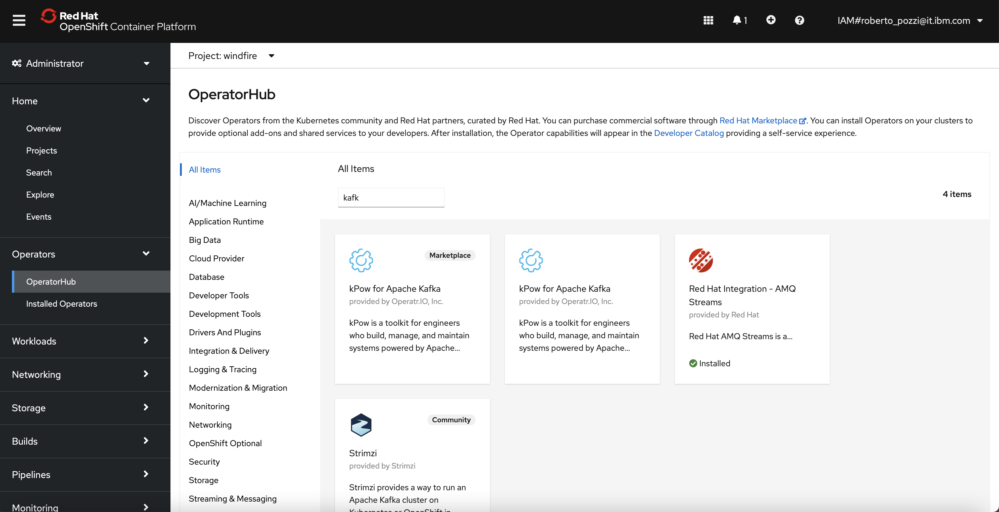
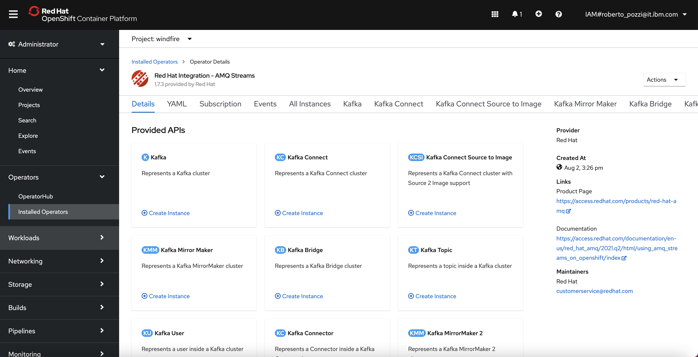
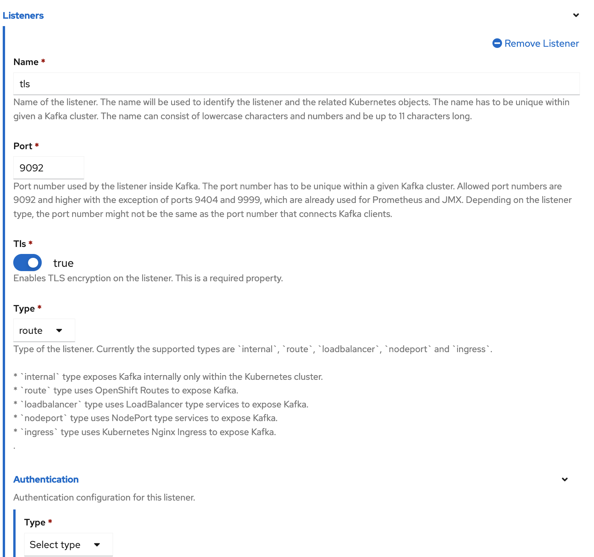

# Raspberry sensors project - PART 2
- [Introduction](#introduction)
- [Architecture](#architecture)
    - [DHT11 sensor setup](#DHT11-sensor-setup)
    - [Kafka cluster](#kafka-cluster)
    - [Read and send sensor data with Python](#read-and-send-sensor-data-with-python)
        - [Deployment to Raspberry](#deployment-to-raspberry)
    - [Consume sensor data with Node](#consume-sensor-data-with-node)

## Introduction
The concept of this project is to use sensors connected to a Raspberry Pi board and continuously get, visualize and manage data from the sensors.

Initially, a DHT11 sensor is used to get Temperature and Humidity data points.

To access code and scripts for the project, start by cloning this repository 
```
mkdir $HOME/dev
cd $HOME/dev
git https://github.com/robipozzi/robipozzi-raspberry-sensors 
cd robipozzi-raspberry-sensors
```

## Architecture
The overall architecture design is very simple: a Python program runs on a Raspberry board, reads data from a sensor and continuously sends sensor data to a Kafka topic. A web server, implemented in Node.js, consumes data from the Kafka topic and continuously updates a UI via Web Socket.

The logical architecture is sketched below


These are the macro activities and steps to take to actually implement this logical architecture:
1. Connect DHT11 sensor to Raspberry Pi board.
2. Deploy a Kafka cluster (the code in this repository assumes OpenShift as the target infrastructure).
3. Get the TLS certificate from Kafka and generate PEM files to securely connect to Kafka.
4. Deploy Python program to Raspberry Pi.
5. Deploy Node.js server to run Home Automation UI component.

### DHT11 sensor setup
Refer to https://www.raspberrypi-spy.co.uk/2017/09/dht11-temperature-and-humidity-sensor-raspberry-pi/?utm_source=pocket_mylist for instructions on how to setup a DHT11 sensor and connect to Raspberry Pi.

### Kafka cluster
Kafka is a distributed system consisting of servers and clients that communicate via a high-performance TCP network protocol. It can be deployed on bare-metal hardware, virtual machines, and containers in on-premise as well as cloud environments, more info are available at https://kafka.apache.org/intro.

I find very convenient to instantiate it on Red Hat Openshift using Operator Hub, which provides Red Hat AMQ Streams, a massively scalable, distributed, and high performance data streaming platform based on the Apache Kafka® project; Red Hat AMQ Streams is built on the upstream open source project Strimzi.

In Red Hat Openshift console go to **OperatorHub**, search for Kafka and click on Red Hat AMQ Streams operator tile, as below



Once the operator has been installed, go to **Installed Operators** and select Red Hat AMQ Streams, you will land on the operator administration page where you can create, configure and delete Apache Kafka clusters, topics and many more.



From the Red Hat AMQ Streams operator administration page, do the following:

* Create a Kafka cluster, name it **robipozzi-kafka**, ensure there is at least 1 listener of type **route** named **tls**: since it is of type route, this listener requires to have **tls=true** meaning that connection to the listener will be required to be secured with a TLS certificate.



* Create a Kafka topic and name it **sensor**.

### Read and send sensor data with Python
All the magic happens in **[sensor.py](kafka/sensor.py)** Python program, which reads data from DHT11 sensor and sends to a Kafka topic; 
Run the following
```
###### Variable setup - START
# Bootstrap server for Kafka on Red Hat Openshift
BOOTSTRAP_SERVER=<SET THE RIGHT BOOTSTRAP SERVER FOR YOUR KAFKA CLUSTER>
###### Variable setup - END
# **** Run Python program
KAFKA_BROKER=$BOOTSTRAP_SERVER SSL=true TOPIC=sensor python sensor.py
```

A Kafka cluster deployed on OpenShift is secured by default and a TLS certificate is required to access it; moreover, Python uses PEM files so you need to adequately convert a keystore to a PEM file; a couple of convenient scripts are provided to do the job:

* The **[extractKafkaTLSCert.sh](security/extractKafkaTLSCert.sh)** script connects to OpenShift (you firstly need to authenticate to OpenShift cluster with **oc** command line utility), extracts the certificate key from the Secret that has been generated by OpenShift when Kafka has been instantiated and creates the keystore.
```
cd $HOME/dev/windfire-home-automation/security
./extractKafkaTLSCert.sh
```

* The **[pem-converter.sh](security/pem-converter.sh)** script calls **[jkstopem.sh](security/jkstopem.sh)** which takes the keystore and generates the PEM file that can then be used by Python program to securely connect to Kafka.
```
cd $HOME/dev/windfire-home-automation/security
./pem-converter.sh
```
**WARNING**: ensure the generated certificates, truststores and PEM files **are added to .gitignore** and **never get shared on GitHub**.

#### Deployment to Raspberry
Python program needs to run on Raspberry, the Ansible playbook **[home-automation.yaml](deployment/raspberry/home-automation.yaml)** is provided to fully automate the deployment, run **[install.sh](deployment/raspberry/install.sh)** script to launch the deployment procedure.
```
cd $HOME/dev/windfire-home-automation/deployment/raspberry
./install.sh
```
Refer to https://github.com/robipozzi/windfire-raspberry for instructions on how to setup Ansible on Raspberry.

Python program **[sensor.py](kafka/sensor.py)** uses some Python modules that need to be imported and available in the environment: required modules are defined in **[requirements.txt](kafka/requirements.txt)** file.

Once you have deployed the program, **connect to Raspberry and launch the following**
```
cd /home/pi/home-automation/kafka
./pip-install.sh
```
The script will install all the required Python modules; after this you are finally ready to launch Python program with the following:
```
cd /home/pi/home-automation/kafka
./run-sensor.sh
```
For test purposes the program can also be run in simulated mode: it will not get data from the actual sensor but just randomly generate Temperature and Humidity data and send to Kafka topic. 

To run in simulated mode:
```
cd /home/pi/home-automation/kafka
./run-sensor.sh --simulate
```

### Consume sensor data with Node
Once Kafka is setup and Python is deployed and runs on Raspberry, data are continuously read from the DHT11 sensor and written to **sensor** Kafka topic, on the other end some application needs to read the data from Kafka and make use of it, and here comes the Node.js component of the architecture.

The overall application logic is implemented in **[app.js](ui/nodejs/app/app.js)** which basically does the following:
1. Read data from **sensor** Kafka topic: **[sensorConsumer.js](ui/nodejs/app/sensorConsumer.js)** is responsible for this task, using **kafkajs** (https://kafka.js.org/) to implement the logic to connect and consume data from Kafka topic.
2. Send the data coming from Kafka to the User Interface component via a Web Socket.
3. Render the data with a simple HTML page and Javascript to continuously update Canvas Gauges charts (https://canvas-gauges.com/) that graphically represent the sensor data on the Web Ui interface.

The application is secured using Auth0 (https://auth0.com/) with Multi Factor Authentication, configured to run with *Google Authenticator*.

Environment variables for Auth0 authentication to work correctly need to be set at the startup of the application.
```
// #######################################
// ###### Auth0 Authorization setup ######
// #######################################
var SECRET = process.env.AUTH0_SECRET;
var BASE_URL = process.env.BASE_URL;
var CLIENTID = process.env.AUTH0_CLIENTID;
var ISSUER_BASE_URL = process.env.AUTH0_ISSUER_BASE_URL;
const config = {
	authRequired: false,
	auth0Logout: true,
	secret: SECRET,
	baseURL: BASE_URL,
	clientID: CLIENTID,
	issuerBaseURL: ISSUER_BASE_URL
};
```
A placeholder script **[set-Auth0-env_PLACEHOLDER.sh](ui/nodejs/set-Auth0-env_PLACEHOLDER.sh)** is provided with the environment variables that need to be set in order for the application to work under Auth0 security mechanism; before starting the application copy the script to
*  **set-Auth0-env.sh** for localhost deployment and set the appropriate parameter
*  **set-Auth0-env-openshift.sh** for Openshift deployment and set the appropriate parameter

**WARNING** : ensure to **add to .gitignore** and **never share on GitHub**

Run **[app-run.sh](ui/nodejs/app/app-run.sh)** shell script to start Node.js application.
```
cd $HOME/dev/windfire-home-automation/ui/nodejs/app
./app-run.sh
```