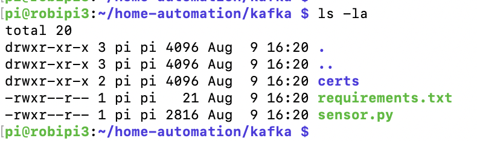
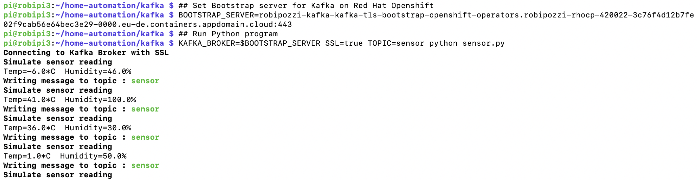
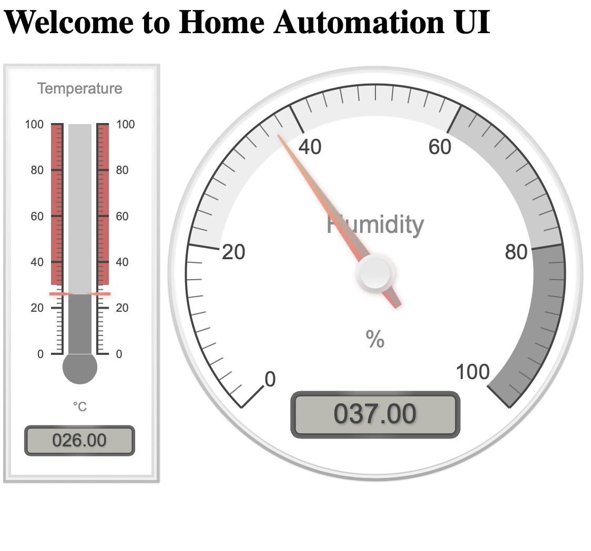

# Raspberry sensors project - PART 2
- [Introduction](#introduction)
- [Architecture](#architecture)
- [Connect DHT11 sensor to Raspberry](#connect-DHT11-sensor-to-raspberry)
- [Update Python program to read from sensor](#update-python-program-to-read-from-sensor)
- [Consume sensor data with Node](#consume-sensor-data-with-node)


## Introduction
In this second part we will build on Part 1 and extend it to with the following steps:
* Connect a DHT11 sensor to Raspberry Pi;
* Modify **[sensor.py](kafka/sensor.py)** to read data from the sensor;
* Run a Node.js web server to render the data with a simple HTML page and Javascript to continuously update Canvas Gauges charts (https://canvas-gauges.com/) that graphically represent the sensor data on the Web Ui interface.

To access code and scripts for the project, start by cloning this repository 
```
mkdir $HOME/dev
cd $HOME/dev
git clone https://github.com/robipozzi/robipozzi-raspberry-sensors 
cd robipozzi-raspberry-sensors/Part2
```

## Architecture
The overall architecture design is very simple: a Python program runs on a Raspberry board, reads data from a sensor and continuously sends sensor data to a Kafka topic. A web server, implemented in Node.js, consumes data from the Kafka topic and continuously updates a UI via Web Socket.

The logical architecture is sketched below


## Connect DHT11 sensor to Raspberry
First step is obviously to connect a sensor to a Raspberry Pi; instructions on how to setup a DHT11 sensor are conveniently accessible at the following link https://www.raspberrypi-spy.co.uk/2017/09/dht11-temperature-and-humidity-sensor-raspberry-pi/?utm_source=pocket_mylist.

## Update Python program to read from sensor
The logic to send data to a Kafka topic resides in **[sensor.py](kafka/sensor.py)** Python program; in Part1 the program simulated sensor data by randomly generating temperature and humidity values.

The first thing to do is now getting rid of the simulation and reading real data from the connected DHT11 sensor: have a look at the updated **[sensor.py](kafka/sensor.py)** Python program.

The Kafka cluster running on Openshift is secured by default (Secrets are created within the cluster to hold TLS certificates) so, before starting to send data to Kafka, we need to extract the certificate from Kafka cluster:
* Login to Openshift cluster.
* Extract the certificate from Openshift Secret.
* Create a truststore to hold the certificate.
```
## Login to Openshift 

## Extract the certificate key from the Openshift Secret
oc extract secret/robipozzi-kafka-cluster-ca-cert --keys=ca.crt --to=certs --confirm -n openshift-operators

## Import extracted certificate to a Truststore
keytool -import -trustcacerts -alias root -file certs/ca.crt -keystore certs/truststore.jks -storepass password -noprompt
```
And then generate PEM files in order for a Python program to securely connect to Kafka.
The **[jkstopem.sh](jkstopem.sh)** script is provided to do the job, run the following
```
./jkstopem.sh certs truststore.jks password root kafka/certs
```
### Deploy and run Python program on Raspberry
Python program needs to run on Raspberry, an Ansible playbook **[home-automation.yaml](deployment/home-automation.yaml)** is provided to fully automate the deployment, run the following
```
cd $HOME/dev/robipozzi-raspberry-sensors/Part2/deployment
ansible-playbook home-automation.yaml
```
Refer to https://github.com/robipozzi/windfire-raspberry for instructions on how to setup Ansible on Raspberry.

Connect to Raspberry and you should find something like this



All the magic actually happens in **[sensor.py](kafka/sensor.py)** Python program, which simulates data from DHT11 sensor and sends to a Kafka topic.

The **[sensor.py](kafka/sensor.py)** program uses some Python modules that need to be imported and available in the environment before you can run it: required modules are defined in **[requirements.txt](kafka/requirements.txt)** dependency file.

When still connected to Raspberry Pi box run the following
```
cd /home/pi/home-automation/kafka
sudo pip install -r requirements.txt
```
With this we are all set and ready to run Python program with the following commands

**Pay attention to this**
Get Route URL for Bootstrap Server (as seen in Figure 5) and remember to:
- strip **https://** away from the Route URL
- always add port **443** to the URL

```
## Set Bootstrap server for Kafka on Red Hat Openshift
BOOTSTRAP_SERVER=robipozzi-kafka-kafka-tls-bootstrap-openshift-operators.robipozzi-rhocp-420022-3c76f4d12b7fe02f9cab56e64bec3e29-0000.eu-de.containers.appdomain.cloud:443
## Run Python program
KAFKA_BROKER=$BOOTSTRAP_SERVER SSL=true TOPIC=sensor python sensor.py
```

You should see something similar to the following, meaning that Python program has connected to Kafka, is randomly generating simulated data for temperature and humidity and sending to Kafka topic.



## Consume sensor data with Node
Once Kafka is setup and Python is deployed and runs on Raspberry, data are continuously read from the DHT11 sensor and written to **sensor** Kafka topic, on the other end some application needs to read the data from Kafka and make use of it, and here comes the Node.js component of the architecture.

The overall application logic is implemented in **[app.js](nodejs/app.js)** which basically does the following:
1. Read data from **sensor** Kafka topic: **[sensorConsumer.js](nodejs/sensorConsumer.js)** is responsible for this task, using **kafkajs** (https://kafka.js.org/) to implement the logic to connect and consume data from Kafka topic.
2. Send the data coming from Kafka to the User Interface component via a Web Socket.
3. Render the data with a simple HTML page and Javascript to continuously update Canvas Gauges charts (https://canvas-gauges.com/) that graphically represent the sensor data on the Web Ui interface.

Node.js application also needs to securely connect to the Kafka cluster to consume the sensor data and so, before running it, we will need to access the correct TLS certificate.

The following command will do the job, extracting the certificate from Openshift Secret and copying it to nodejs/certs sub-folder where is available for the Node.js application to pick it up and use it to securely connect to Kafka.
```
cd $HOME/dev/robipozzi-raspberry-sensors/Part2

## Login to Openshift 

## Extract the certificate key from the Openshift Secret
oc extract secret/robipozzi-kafka-cluster-ca-cert --keys=ca.crt --to=nodejs/certs --confirm -n openshift-operators
```
The application uses some Node.js modules, that you need to install using NPM, do the following.
```
cd $HOME/dev/robipozzi-raspberry-sensors/Part2/nodejs

### Install required modules with NPM
npm install
```
With this we can finally start and run the application with the following.
```
## Set Bootstrap server for Kafka on Red Hat Openshift
KAFKA_BOOTSTRAP_SERVER=robipozzi-kafka-kafka-tls-bootstrap-openshift-operators.robipozzi-rhocp-420022-3c76f4d12b7fe02f9cab56e64bec3e29-0000.eu-de.containers.appdomain.cloud:443

## Run Node.js server
KAFKA_BOOTSTRAP_SERVER=$KAFKA_BOOTSTRAP_SERVER \
KAFKA_SENSOR_TOPIC=sensor \
npm start
```

In a web browser launch **http://localhost:8082** and you should find something similar to this, you will see the gauges updating with the data coming from the sensor attached to Raspberry Pi.
