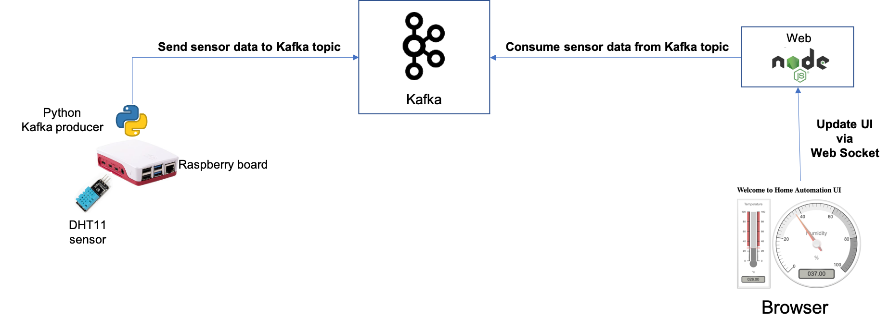

# Raspberry sensors project
- [Introduction](#introduction)
- [Architecture](#architecture)
- [Part 1](#part-1)
- [Part 2](#part-2)

## Introduction
The concept of this project is to use sensors connected to a Raspberry Pi board and continuously get, visualize and manage data from the sensors.

Initially, a DHT11 sensor is used to get Temperature and Humidity data points.

## Architecture
The overall architecture design is very simple: a Python program runs on a Raspberry board, reads data from a sensor and continuously sends sensor data to a Kafka topic. A web server, implemented in Node.js, consumes data from the Kafka topic and continuously updates a UI via Web Socket.

The logical architecture is sketched below

These are the macro activities and steps to take to actually implement this logical architecture:
1. Connect DHT11 sensor to Raspberry Pi board.
2. Deploy a Kafka cluster (the code in this repository assumes OpenShift as the target infrastructure).
3. Get the TLS certificate from Kafka and generate PEM files to securely connect to Kafka.
4. Deploy Python program to Raspberry Pi.
5. Deploy Node.js server to run Home Automation UI component.

## Part 1
In the first we will 
* Deploy a Kafka cluster (I instantiated Kafka using the very convenient Operator available on Red Hat Openshift);
* Get the TLS certificate from Kafka and generate PEM files to connect securely to Kafka;
* Deploy a Python program to Raspberry Pi to send data to Kafka (data will be simulated, then in a future article we will build on this and get real data from DHT11).

[Go Here](Part1/README.md) for instructions.

## Part 2
[Go Here](Part2/README.md) for instructions.